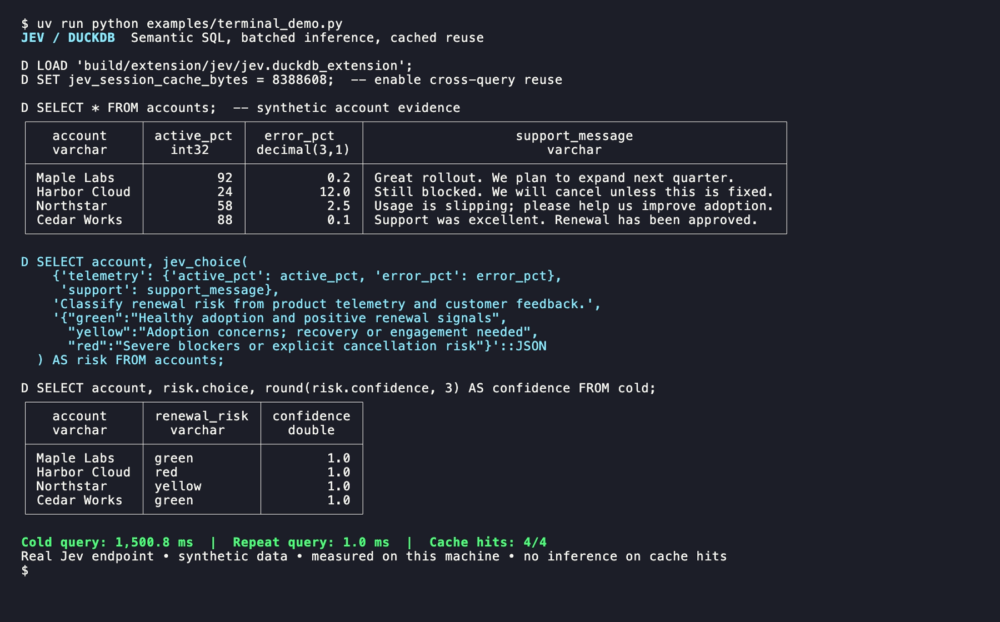

# Jev for DuckDB

[](https://github.com/prasanthj/duckdb-jev/actions/workflows/release.yml)
[](https://duckdb.org/docs/stable/extensions/extension_distribution)
[](docs/distribution.md)



*Real Jev responses on synthetic data. Captured with VHS; timings are from one local run.*

Native C++ extension for semantic predicates, classification and rubric scoring through TypeSafe/Jev. No Python UDF registration or Python inference server is required. Python/uv manage the build and test tools.

Implemented and tested on macOS arm64 with DuckDB **1.5.5**. The built artifact is `build/extension/jev/jev.duckdb_extension`. Native C++ extensions must match DuckDB's version and platform; other platforms need their own build and verification.

Prebuilt archives are published through [GitHub Releases](https://github.com/prasanthj/duckdb-jev/releases) after all four platform builds pass. See [distribution and installation](docs/distribution.md) for compatibility, checksums, and release instructions.

## Build and test

Requirements: `uv`, Git, a C++17 compiler, and libcurl development headers/libraries. macOS Xcode command-line tools provide the native toolchain; Linux generally needs a compiler and libcurl development package. CMake, Ninja, clang-format and Python test tools are installed through uv.

```sh
./build.sh
uv run pytest -q                  # local HTTP stub, no paid inference
uv run pyright tests benchmarks
uv run ruff check tests benchmarks
```

The build disables jemalloc in the statically linked extension core to avoid an upstream non-unity compilation issue; it does not change the host DuckDB runtime’s allocator.

The first build downloads pinned DuckDB v1.5.5 sources and builds the required core static library; subsequent builds are incremental. The vendored nlohmann JSON header is v3.12.0 and retains its upstream MIT license notice. No daemon is left running by the tests or benchmarks.

## Load and use

Local unsigned development extension:

```sh
duckdb -unsigned
```

```sql
LOAD '/absolute/path/to/duckdb-jev/build/extension/jev/jev.duckdb_extension';

SELECT jev('Customer explicitly asks for a refund', 'Is a refund requested?', 0.8);

SELECT jev_choice(
  {'ticket': 'I was billed twice', 'plan': 'enterprise'},
  'Which team should handle the ticket?',
  '{"billing":"Charges and refunds", "technical":"Bugs and outages"}'::JSON
);

SELECT jev_score(
  'The app keeps crashing and nobody has responded.',
  'How frustrated is the customer?',
  '["Calm", "Concerned", "Very frustrated"]'::JSON
);
```

For Python, load the **same native binary**:

```python
import duckdb
con = duckdb.connect(config={"allow_unsigned_extensions": True})
con.execute("LOAD '/absolute/path/to/jev.duckdb_extension'")
```

Set `TYPESAFE_API_KEY` in the environment. Credentials are never needed in SQL. The native C++ extension uses the HTTP API directly and does not load local credential files or depend on the Python SDK. Input data goes to TypeSafe for remote inference. DuckDB `enable_external_access=false` prevents requests.

## Functions

| Function | Returns |
|---|---|
| `jev(evidence, predicate, threshold)` | BOOLEAN, Noul probability >= explicit threshold |
| `jev_noul(evidence, instructions [, criteria])` | STRUCT with `noul`, `model`, `cache_hit` |
| `jev_choice(evidence, instructions, criteria)` | STRUCT with `choice`, `confidence`, `probabilities`, `model`, `cache_hit` |
| `jev_score(evidence, instructions, levels)` | STRUCT with `score`, `confidence`, `probabilities`, `legend`, `model`, `cache_hit` |
| `jev_eval(evidence, questions)` | STRUCT with named `answers` as JSON, `model`, `cache_hit` |

Evidence supports text, JSON objects/arrays, and nested DuckDB STRUCT/LIST/ARRAY. Nested nulls are preserved. Decimal, huge integer, date and timestamp fields serialize as lossless strings; ordinary integer/boolean/float fields retain JSON types. Unsupported types require an explicit `to_json()` conversion. Non-finite numbers and top-level scalar numeric/boolean/JSON-null states are rejected. Any SQL NULL argument produces NULL without parsing other arguments or making a request.

Instructions accept strings, STRUCTs, lists or JSON. Plain text instructions are never heuristically parsed. Criteria accept JSON text/JSON/STRUCT for Choice/Noul and JSON text/JSON/list for Score. Choice supports 1–255 options, Score 2–10 ordered levels; optional Noul criteria describe `true`/`false`. Choice descriptions and Score levels may be nested objects/arrays. Unknown question fields/types are rejected.

`confidence` is the provider's distribution-derived confidence, not necessarily the winning-label probability. Noul has no separate confidence. Score is the expected rubric index, potentially fractional, not an automatic 0–100 band. Access outputs with `(jev_choice(...)).choice`, etc. Materialize results when multiple downstream columns or filters need the same judgment:

```sql
CREATE TEMP TABLE judged AS
SELECT id, jev_eval(to_json(evidence), '{
  "refund": {"type":"noul","instructions":"Does the ticket request a refund?"},
  "tone": {"type":"choice","instructions":"Classify the expressed tone",
           "criteria":{"positive":null,"neutral":null,"negative":null}}
}'::JSON) AS judgment
FROM selected_tickets;

SELECT id, judgment.answers->'tone' FROM judged;
```

See [renewal.sql](examples/renewal.sql) for a realistic multi-question account workflow. Separate scalar calls are not automatically fused; use `jev_eval` to combine questions for one row.

## Batching and concurrency

The scalar functions process DuckDB chunks. They respect validity/selection vectors, deduplicate identical evidence and questions within a chunk, pack questions into byte/count-bounded HTTP requests, and reassemble answers by IDs regardless of completion order. Constant evidence/instructions/criteria are converted once per chunk. Completed results are also reused across chunks and expressions within the same query. Payload packing uses incremental byte accounting rather than repeatedly copying/serializing a growing request.

A persistent 10-worker pool reuses CURL connection caches across chunks. The scheduler admits tasks only when their connection's concurrency limit permits, so a concurrency-1 query does not occupy all workers with waiting tasks. At most 10 requests run across the process. No automatic retries.

```sql
SET jev_model = 'jev-latest';
SET jev_batch_size = 25;                 -- questions per request, NOT rows
SET jev_concurrency = 10;               -- per connection, process ceiling 10
SET jev_max_request_bytes = 65536;      -- exact serialized HTTP body cap
SET jev_timeout_ms = 30000;

-- Independent concurrent requests, without request batching:
SET jev_batch_size = 1;
```

`jev_endpoint` is a trusted session setting, defaulting to `https://api.typesafe.ai/v1/systemone`. HTTPS is required except for localhost/127.0.0.1 test servers. Redirect following is disabled. Unknown options fail through DuckDB. Settings and the environment key are snapshotted at the first non-null Jev evaluation in each query; don't mutate the same connection concurrently during a query.

Allowed ranges: batch 1–1000, concurrency 1–10, request bytes 256–1048576, timeout 1–300000ms. These are **extension controls**, not claims about Jev limits. The byte cap is not a tokenizer and cannot guarantee fitting the model context. Oversized evidence fails without truncation. Unique serialized chunk input and expanded packed payload each have separate 32MiB caps; total process RSS includes other objects and is higher.

`cache_hit` means reuse within the current chunk or sharing an in-flight/completed evaluation in the **same query**. The query cache defaults to 8MiB of serialized keys and results, with at most 4096 entries. Set `jev_cache_bytes=0` to disable cross-chunk reuse (chunk deduplication remains), or choose a budget up to 64MiB. When full, new entries bypass the cache; results remain complete. These limits bound retained serialized data and entry count, not total RSS. Simultaneous misses share an in-flight result within the same query. The in-flight registry is separately bounded to 4096 keys and 8MiB of serialized key bytes; above that bound, requests proceed independently. Disabling the completed-result cache does not disable in-flight sharing.

Query results and the configuration/key snapshot are cleared at query end, including errors/cancellation. Prepared-statement executions and statements inside a transaction get separate caches. No disk cache exists. By default repeated queries call the service again; cross-query reuse requires the explicit connection-cache opt-in below. `LIMIT` does not guarantee an exact number of calls because SQL operates in chunks. Materialize deterministic candidate rows before inference when bounding spend matters. Rollback cannot undo API charges.

Provider failures raise a query error, never FALSE or a low-confidence prediction. Timeout, malformed output, missing/extra answers, invalid choices/probabilities and HTTP errors fail closed with sanitized messages. Cancellation stops further scheduled work and interrupts transfers; requests already accepted remotely may still be billable. `EXPLAIN` makes no calls; `EXPLAIN ANALYZE` executes.

## Repeated queries and persisted reuse

```sql
-- Opt-in, per connection; disabled by default.
SET jev_session_cache_bytes = 8388608;  -- 8MiB, maximum 64MiB / 4096 entries
SET jev_session_cache_ttl_ms = 60000;   -- non-sliding TTL; maximum 24 hours
-- Run the same enrichment again: validated rows can return with no HTTP call.
SELECT jev_cache_clear();              -- clear connection LRU, as a separate statement
```

The connection LRU stores each canonical evidence/question judgment independently of batching. It retains only validated successful answers, with original model and confidence. Changing model, endpoint, credentials, cache budget or TTL invalidates the LRU on the next Jev evaluation. Its scope is a SHA-256 fingerprint; credentials are not retained in cache keys or written to disk. It is isolated per DuckDB connection, not a distributed tenant cache. TTL starts when a result is stored and cache reads do not extend it. Cache payloads are shared immutably between matching rows rather than copied for every pending row. Limits count retained serialized keys/results and entries, not total RSS.

`jev_cache_clear()` clears the connection LRU only; use it between enrichment queries. Already running query work can produce new entries. A model alias such as `jev-latest` may change before TTL expiration: pin a model version for reproducibility or use a short TTL. Closing the connection drops the cache.

For reuse across processes, export validated enrichment to Parquet with an input fingerprint, enrichment-spec fingerprint, model, confidence, and creation/expiry metadata. Join against it before running inference and send only misses/stale rows. `benchmarks.live_cache` demonstrates a Parquet join in a fresh connection without loading the extension. Exported results should retain the same access controls as their source data. Distributed caching is outside this implementation.

## Streaming relational input

```sql
SELECT row_id, answers, model, cache_hit
FROM jev_stream((
  SELECT
    ticket_id,
    {'message': message, 'account': account, 'telemetry': telemetry},
    '{"sentiment":{"type":"score","instructions":"Assess the tone of the customer message.",
      "criteria":["Very negative","Negative","Neutral","Positive","Very positive"]}}'::JSON
  FROM support_tickets
))
ORDER BY row_id;
```

Pass a table subquery with exactly three columns, in order: a correlation ID, evidence, and the same question-object schema used by `jev_eval`. Results preserve supplied IDs, including duplicates and NULL IDs. A NULL evidence or questions value produces NULL result fields without an API call. Input column names are arbitrary; output columns are `row_id`, `answers` (JSON), `model`, and `cache_hit`. Use `ORDER BY` when ordering matters. Use the direct TABLE-subquery form shown above, not a lateral per-row invocation.

This native table-in/out operator retains partial HTTP batches across input chunks, submits full batches while consuming input, and emits ready row prefixes between chunks. A single input producer feeds the shared HTTP pool; network concurrency still follows `jev_concurrency`. It retains at most 8192 pending rows, 16MiB of serialized input keys/IDs, and 32MiB of serialized buffered answers, with at most twice the configured concurrency in queued/running job slots. Each request and response also has its existing byte limit; returned model identifiers are limited to 1024 bytes. These are separate serialized-data/object-count bounds, not total RSS guarantees.

Backpressure and finalization flush partial packs before waiting, so memory stays bounded and the final tail is returned. A slow earlier row can delay output. `LIMIT` can prefetch/pay for more rows than it returns; prepare a bounded input subquery when spend matters. Errors, cancellation, and early termination cancel/join outstanding jobs before destroying state. Already accepted API calls can still be billable.

## Performance verification

```sh
uv run python -m benchmarks.run --rows 1000 --repeats 3 --delay-ms 10
uv run python -m benchmarks.stream
# CPU/transport baseline without simulated service delay:
uv run python -m benchmarks.run --rows 1000 --repeats 3 --delay-ms 0
```

The benchmark starts only a local deterministic HTTP server and saves manifest, per-trial data, summaries and a report under `benchmarks/results/<timestamp>/`. It covers batch sizes 1/25/100 and concurrency 1/4/10 by default. These are extension/HTTP measurements, **not Jev latency or semantic accuracy claims**. See [real Jev results](docs/live-results.md), [local benchmark results](docs/benchmark-results.md) and the [independent performance review](docs/performance-review.md).

Tests cover all primitives, mixed questions, constant/dictionary/flat vectors, nested nulls, multiple chunks, connection reuse, byte caps, oversized expanded payloads, response order, concurrency across connections, scheduler fairness, cancellation, timeout, queued failures, malformed outputs, query-cache budgets, statement/connection isolation, prepared execution, and cross-expression reuse.

Two explicitly opt-in tests contact TypeSafe: one scalar request with three questions and one streaming request with two rows (five questions total):

For measured live runs (billable, explicitly bounded, no retries):

```sh
uv run python -m benchmarks.live --live
uv run python -m benchmarks.live_cache --live
```

The first run caps itself at 1500 HTTP requests / 12000 questions by default. It saves inputs, outputs, per-request timing/usage, per-query results and summaries. The second caps at 40 requests / 800 questions and compares first runs, cached repeats, and offline Parquet reuse. Both read `TYPESAFE_API_KEY` only. Timing includes the loopback instrumentation relay; it is not a pure provider-internal latency measure.

```sh
JEV_RUN_LIVE=1 uv run pytest -q tests/test_live.py
```

The scalar test saves its small response to `benchmarks/results/live-smoke.json`. Both are skipped in ordinary test runs.

## Current limits

This is a working local native extension, not a signed/published community extension. No automatic discovery of tables, shared or disk-backed cache, DuckDB secret-provider integration, request-usage SQL metrics relation, or automatic retries have been added. The [original design](docs/design.md) is a proposal; this README describes what is implemented. Scalar functions remain synchronous per chunk. Use `jev_stream` for bounded input prefetch, cross-chunk request packing, and overlapping HTTP work. Stub tests prove transport/mapping correctness, not model equivalence across all batch sizes; the small live smoke confirms protocol compatibility only.


The current artifact targets native DuckDB, not DuckDB-Wasm. A Wasm port requires a matching Wasm extension build plus browser-compatible transport, scheduling, and credentials. See [DuckDB-Wasm extension documentation](https://duckdb.org/docs/current/clients/wasm/extensions).
