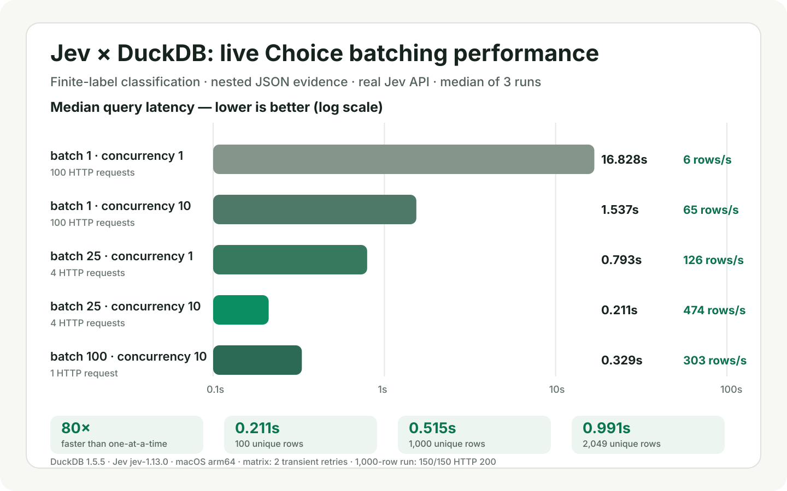

# Jev for DuckDB

[](https://github.com/prasanthj/duckdb-jev/actions/workflows/release.yml)
[](https://github.com/prasanthj/duckdb-jev/actions/workflows/ci.yml)
[](https://duckdb.org/docs/stable/extensions/extension_distribution)
[](docs/distribution.md)
[](LICENSE)

High-throughput, robust native C++ DuckDB extension for semantic predicates, classification and rubric scoring through TypeSafe/Jev. It batches and streams inference directly from SQL without Python UDF registration or a separate inference server.


*Real Jev responses on synthetic data; timings are from one local run. Reproduce the animation with `vhs examples/terminal_demo.tape`.*

## Features

- **SQL-native judgments:** Noul predicates, finite Choice classification, ordered Score rubrics and mixed multi-question evaluation.
- **Batched and streaming execution:** packs up to 1,000 independent judgments per request, runs bounded concurrent HTTP work and streams across DuckDB chunks.
- **Structured evidence:** evaluates text, JSON, STRUCT, LIST and ARRAY values without exporting columns through Python or pandas.
- **Safe credentials:** reads a scoped DuckDB `jev` secret first and falls back to `TYPESAFE_API_KEY`; API keys never appear in query results or cache keys.
- **Production controls:** strict response validation, cancellation, bounded memory, per-query request/question budgets and jittered retries for transient failures.
- **Measured reuse:** query deduplication, concurrent-miss coalescing, opt-in connection LRU with TTL and an offline Parquet reuse pattern.
- **Observable:** `jev_stats()` reports requests, questions, retries, failures, cache hits, tokens, bytes and transport latency.
- **Verifiable releases:** native macOS/Linux builds for x86-64 and ARM64, SHA-256 checksums, SPDX SBOMs and GitHub build provenance.

## Live performance



These are live `jev_stream` **Choice** classifications against the real TypeSafe API and `jev-1.13.0`, not a simulated service. Each unique nested JSON row is assigned one of four routing labels. Runs used DuckDB 1.5.5 on macOS arm64.

| Rows | Batch | Concurrency | Requests/query | Median query time | Median throughput |
|---:|---:|---:|---:|---:|---:|
| 100 | 1 | 1 | 100 | 16.828s | 6 rows/s |
| 100 | 25 | 10 | 4 | **0.211s** | **474 rows/s** |
| 100 | 100 | 10 | 1 | 0.329s | 303 rows/s |
| 1,000 | 25 | 10 | 40 | 0.964s | 1,037 rows/s |
| 1,000 | 100 | 10 | 10 | **0.515s** | **1,943 rows/s** |

For 100 rows, batch 25 is fastest because its four requests overlap. For 1,000 rows, batch 100 produces exactly ten requests and fills the configured ten-way concurrency in one wave. A separate 2,049-row scale check at batch 100/concurrency 10 completed in 0.991s.

The 100- and 1,000-row figures are medians of three complete queries and include DuckDB execution, fetch, ordering, relay instrumentation, network time, and Jev inference. The fixed 12-template corpus tests throughput and regression behavior; matching its expected labels is not a general accuracy claim. Two transient responses in the 100-row one-at-a-time matrix were retried successfully. All 150 responses in the 1,000-row run were HTTP 200. See the [method, complete matrix, request percentiles, and raw-artifact locations](docs/live-results.md).

Implemented and tested with DuckDB **1.4.5** and **1.5.5**. The built artifact is `build/extension/jev/jev.duckdb_extension`. Native C++ extensions must match DuckDB's version and platform; each version/platform combination needs its own build and verification.

Prebuilt archives are published through [GitHub Releases](https://github.com/prasanthj/duckdb-jev/releases) after all eight version/platform builds pass. See [distribution and installation](docs/distribution.md) for compatibility, checksums, and release instructions.

## Build and test

Requirements: `uv`, Git, a C++17 compiler, and libcurl development headers/libraries. macOS Xcode command-line tools provide the native toolchain; Linux generally needs a compiler and libcurl development package. CMake, Ninja, clang-format and Python test tools are installed through uv.

```sh
./build.sh                           # DuckDB 1.5.5 (default)
DUCKDB_VERSION=1.4.5 ./build.sh      # DuckDB 1.4.5
uv run pytest -q                  # local HTTP stub, no paid inference
uv run pyright tests benchmarks scripts examples
uv run ruff check tests benchmarks scripts examples
```

The extension links DuckDB's official pinned platform static library into the loadable binary. This keeps it compatible with Python and other hosts that do not export DuckDB symbols globally, without recompiling DuckDB core.

The first build downloads pinned headers and the matching official static-library archive for the selected DuckDB version, verifies both the source commit and archive SHA-256, then compiles only the extension and a small platform probe. Subsequent builds are incremental. Run the matching suite with `DUCKDB_VERSION=1.4.5 uv run --with duckdb==1.4.5 pytest -q` (or substitute `1.5.5`). The vendored nlohmann JSON header is v3.12.0 and retains its upstream MIT license notice. No daemon is left running by the tests or benchmarks.

## License

Licensed under the [Apache License 2.0](LICENSE). Binary release archives also include the applicable DuckDB and nlohmann/json license notices.

## Load and use

Local unsigned development extension:

```sh
duckdb -unsigned
```

```sql
LOAD '/absolute/path/to/duckdb-jev/build/extension/jev/jev.duckdb_extension';

SELECT jev('Customer explicitly asks for a refund', 'Is a refund requested?', 0.8);

SELECT jev_choice(
  {'ticket': 'I was billed twice', 'plan': 'enterprise'},
  'Which team should handle the ticket?',
  '{"billing":"Charges and refunds", "technical":"Bugs and outages"}'::JSON
);

SELECT jev_score(
  'The app keeps crashing and nobody has responded.',
  'How frustrated is the customer?',
  '["Calm", "Concerned", "Very frustrated"]'::JSON
);
```

For Python, load the **same native binary**:

```python
import duckdb
con = duckdb.connect(config={"allow_unsigned_extensions": True})
con.execute("LOAD '/absolute/path/to/jev.duckdb_extension'")
```

Create a temporary DuckDB secret for shared or long-lived processes:

```sql
CREATE SECRET (TYPE jev, API_KEY '...', MODEL 'jev-1.13.0');
```

`ENDPOINT` is also supported. A matching DuckDB secret takes precedence over `TYPESAFE_API_KEY`; the environment variable remains the convenient local fallback. The native extension uses the HTTP API directly and does not load credential files or depend on the Python SDK. Input data goes to TypeSafe for remote inference. DuckDB `enable_external_access=false` prevents requests.

## Functions

| Function | Returns |
|---|---|
| `jev(evidence, predicate, threshold)` | BOOLEAN, Noul probability >= explicit threshold |
| `jev_noul(evidence, instructions [, criteria])` | STRUCT with `noul`, `model`, `cache_hit` |
| `jev_choice(evidence, instructions, criteria)` | STRUCT with `choice`, `confidence`, `probabilities`, `model`, `cache_hit` |
| `jev_score(evidence, instructions, levels)` | STRUCT with `score`, `confidence`, `probabilities`, `legend`, `model`, `cache_hit` |
| `jev_eval(evidence, questions)` | STRUCT with named `answers` as JSON, `model`, `cache_hit` |
| `jev_stats()` | One row of process-level request, question, retry, error, cache, token, byte and latency counters |

Evidence supports text, JSON objects/arrays, and nested DuckDB STRUCT/LIST/ARRAY. Nested nulls are preserved. Decimal, huge integer, date and timestamp fields serialize as lossless strings; ordinary integer/boolean/float fields retain JSON types. Unsupported types require an explicit `to_json()` conversion. Non-finite numbers and top-level scalar numeric/boolean/JSON-null states are rejected. Any SQL NULL argument produces NULL without parsing other arguments or making a request.

Instructions accept strings, STRUCTs, lists or JSON. Plain text instructions are never heuristically parsed. Criteria accept JSON text/JSON/STRUCT for Choice/Noul and JSON text/JSON/list for Score. Choice supports 1–255 options, Score 2–10 ordered levels; optional Noul criteria describe `true`/`false`. Choice descriptions and Score levels may be nested objects/arrays. Unknown question fields/types are rejected.

`confidence` is the provider's distribution-derived confidence, not necessarily the winning-label probability. Noul has no separate confidence. Score is the expected rubric index, potentially fractional, not an automatic 0–100 band. Access outputs with `(jev_choice(...)).choice`, etc. Materialize results when multiple downstream columns or filters need the same judgment:

```sql
CREATE TEMP TABLE judged AS
SELECT id, jev_eval(to_json(evidence), '{
  "refund": {"type":"noul","instructions":"Does the ticket request a refund?"},
  "tone": {"type":"choice","instructions":"Classify the expressed tone",
           "criteria":{"positive":null,"neutral":null,"negative":null}}
}'::JSON) AS judgment
FROM selected_tickets;

SELECT id, judgment.answers->'tone' FROM judged;
```

See [renewal.sql](examples/renewal.sql) for a realistic multi-question account workflow. Separate scalar calls are not automatically fused; use `jev_eval` to combine questions for one row.

## Batching and concurrency

The scalar functions process DuckDB chunks. They respect validity/selection vectors, deduplicate identical evidence and questions within a chunk, pack questions into byte/count-bounded HTTP requests, and reassemble answers by IDs regardless of completion order. Constant evidence/instructions/criteria are converted once per chunk. Completed results are also reused across chunks and expressions within the same query. Payload packing uses incremental byte accounting rather than repeatedly copying/serializing a growing request.

A persistent 10-worker pool reuses CURL connection caches across chunks. The scheduler admits tasks only when their connection's concurrency limit permits, so a concurrency-1 query does not occupy all workers with waiting tasks. At most 10 requests run across the process.

```sql
SET jev_model = 'jev-latest';
SET jev_batch_size = 25;                 -- questions per request, NOT rows
SET jev_concurrency = 10;               -- per connection, process ceiling 10
SET jev_max_request_bytes = 65536;      -- exact serialized HTTP body cap
SET jev_timeout_ms = 30000;
SET jev_max_retries = 2;                 -- transient transport, 429 and 5xx only
SET jev_retry_base_ms = 100;             -- exponential backoff with jitter
SET jev_retry_max_delay_ms = 5000;       -- also caps Retry-After
SET jev_max_questions_per_query = 100000;
SET jev_max_requests_per_query = 2000;

-- Independent concurrent requests, without request batching:
SET jev_batch_size = 1;
```

`jev_endpoint` is a trusted session setting, defaulting to `https://api.typesafe.ai/v1/systemone`. HTTPS is required except for localhost/127.0.0.1 test servers. Redirect following is disabled. Unknown options fail through DuckDB. Settings and the environment key are snapshotted at the first non-null Jev evaluation in each query; don't mutate the same connection concurrently during a query.

Allowed ranges: batch 1–1000, concurrency 1–10, request bytes 256–1048576, timeout 1–300000ms. These are **extension controls**, not claims about Jev limits. The byte cap is not a tokenizer and cannot guarantee fitting the model context. Oversized evidence fails without truncation. Unique serialized chunk input and expanded packed payload each have separate 32MiB caps; total process RSS includes other objects and is higher.

`cache_hit` means reuse within the current chunk or sharing an in-flight/completed evaluation in the **same query**. The query cache defaults to 8MiB of serialized keys and results, with at most 4096 entries. Set `jev_cache_bytes=0` to disable cross-chunk reuse (chunk deduplication remains), or choose a budget up to 64MiB. When full, new entries bypass the cache; results remain complete. These limits bound retained serialized data and entry count, not total RSS. Simultaneous misses share an in-flight result within the same query. The in-flight registry is separately bounded to 4096 keys and 8MiB of serialized key bytes; above that bound, requests proceed independently. Disabling the completed-result cache does not disable in-flight sharing.

Query results and the configuration/key snapshot are cleared at query end, including errors/cancellation. Prepared-statement executions and statements inside a transaction get separate caches. No disk cache exists. By default repeated queries call the service again; cross-query reuse requires the explicit connection-cache opt-in below. `LIMIT` does not guarantee an exact number of calls because SQL operates in chunks. Materialize deterministic candidate rows before inference when bounding spend matters. Rollback cannot undo API charges.

Transient transport failures, HTTP 429 and HTTP 5xx responses retry with exponential backoff, bounded jitter and `Retry-After` support. Other 4xx responses and invalid provider output fail immediately. Retries can duplicate a remotely accepted request if its response was lost, so `jev_stats()` reports them. Provider failures raise a query error, never FALSE or a low-confidence prediction. Cancellation stops further scheduled work and interrupts transfers; requests already accepted remotely may still be billable. `EXPLAIN` makes no calls; `EXPLAIN ANALYZE` executes.

The question and logical-request budgets are checked before scalar dispatch and before each streaming pack. They limit new provider work; cache hits do not consume them. Streaming can have earlier packs in flight before a later pack reaches a query limit, so materialize a bounded input relation when an exact preflight boundary matters.

```sql
SELECT * FROM jev_stats();
```

Usage is process-wide and monotonic for the loaded extension. `requests` counts logical request packs, while `retries` counts additional HTTP attempts. Byte counters include retry traffic. Token counters use provider-reported usage when present. Latency is accumulated per logical request across all of its attempts.

## Repeated queries and persisted reuse

```sql
-- Opt-in, per connection; disabled by default.
SET jev_session_cache_bytes = 8388608;  -- 8MiB, maximum 64MiB / 4096 entries
SET jev_session_cache_ttl_ms = 60000;   -- non-sliding TTL; maximum 24 hours
-- Run the same enrichment again: validated rows can return with no HTTP call.
SELECT jev_cache_clear();              -- clear connection LRU, as a separate statement
```

The connection LRU stores each canonical evidence/question judgment independently of batching. It retains only validated successful answers, with original model and confidence. Changing model, endpoint, credentials, cache budget or TTL invalidates the LRU on the next Jev evaluation. Its scope is a SHA-256 fingerprint; credentials are not retained in cache keys or written to disk. It is isolated per DuckDB connection, not a distributed tenant cache. TTL starts when a result is stored and cache reads do not extend it. Cache payloads are shared immutably between matching rows rather than copied for every pending row. Limits count retained serialized keys/results and entries, not total RSS.

`jev_cache_clear()` clears the connection LRU only; use it between enrichment queries. Already running query work can produce new entries. A model alias such as `jev-latest` may change before TTL expiration: pin a model version for reproducibility or use a short TTL. Closing the connection drops the cache.

For reuse across processes, export validated enrichment to Parquet with an input fingerprint, enrichment-spec fingerprint, model, confidence, and creation/expiry metadata. Join against it before running inference and send only misses/stale rows. `benchmarks.live_cache` demonstrates a Parquet join in a fresh connection without loading the extension. Exported results should retain the same access controls as their source data. Distributed caching is outside this implementation.

## Streaming relational input

```sql
SELECT row_id, answers, model, cache_hit
FROM jev_stream((
  SELECT
    ticket_id,
    {'message': message, 'account': account, 'telemetry': telemetry},
    '{"sentiment":{"type":"score","instructions":"Assess the tone of the customer message.",
      "criteria":["Very negative","Negative","Neutral","Positive","Very positive"]}}'::JSON
  FROM support_tickets
))
ORDER BY row_id;
```

Pass a table subquery with exactly three columns, in order: a correlation ID, evidence, and the same question-object schema used by `jev_eval`. Results preserve supplied IDs, including duplicates and NULL IDs. A NULL evidence or questions value produces NULL result fields without an API call. Input column names are arbitrary; output columns are `row_id`, `answers` (JSON), `model`, and `cache_hit`. Use `ORDER BY` when ordering matters. Use the direct TABLE-subquery form shown above, not a lateral per-row invocation.

This native table-in/out operator retains partial HTTP batches across input chunks, submits full batches while consuming input, and emits ready row prefixes between chunks. A single input producer feeds the shared HTTP pool; network concurrency still follows `jev_concurrency`. It retains at most 8192 pending rows, 16MiB of serialized input keys/IDs, and 32MiB of serialized buffered answers, with at most twice the configured concurrency in queued/running job slots. Each request and response also has its existing byte limit; returned model identifiers are limited to 1024 bytes. These are separate serialized-data/object-count bounds, not total RSS guarantees.

Backpressure and finalization flush partial packs before waiting, so memory stays bounded and the final tail is returned. A slow earlier row can delay output. `LIMIT` can prefetch/pay for more rows than it returns; prepare a bounded input subquery when spend matters. Errors, cancellation, and early termination cancel/join outstanding jobs before destroying state. Already accepted API calls can still be billable.

## Performance verification

```sh
uv run python -m benchmarks.run --rows 1000 --repeats 3 --delay-ms 10
uv run python -m benchmarks.stream
# CPU/transport baseline without simulated service delay:
uv run python -m benchmarks.run --rows 1000 --repeats 3 --delay-ms 0
```

The benchmark starts only a local deterministic HTTP server and saves manifest, per-trial data, summaries and a report under `benchmarks/results/<timestamp>/`. It covers batch sizes 1/25/100 and concurrency 1/4/10 by default. These are extension/HTTP measurements, **not Jev latency or semantic accuracy claims**. Deterministic tests compare complete Choice, Score and Noul answers across batch sizes. See [real Jev results](docs/live-results.md), [local benchmark results](docs/benchmark-results.md) and the [independent performance review](docs/performance-review.md).

Tests cover all primitives, mixed questions, constant/dictionary/flat vectors, nested nulls, multiple chunks, connection reuse, byte caps, oversized expanded payloads, response order, concurrency across connections, scheduler fairness, cancellation, timeout, queued failures, malformed outputs, query-cache budgets, statement/connection isolation, prepared execution, and cross-expression reuse.

Three explicitly opt-in tests contact TypeSafe: a scalar primitive smoke test, a streaming smoke test and a cross-row equivalence test that compares Choice, Score, Noul, confidence and probability outputs at batch sizes 1, 10, 25 and 100:

For measured live runs (billable and explicitly bounded):

```sh
uv run python -m benchmarks.live --live
uv run python -m benchmarks.live_scale --live --rows 1000
uv run python -m benchmarks.live_cache --live
uv run python -m benchmarks.plot_live benchmarks/results/<live-run> docs/images/live-performance.svg \
  --scale-result benchmarks/results/<live-scale-run>
```

The main run caps itself at 1500 HTTP requests / 12000 questions by default. The 1,000-row scaling run is limited to 200 requests / 8000 questions, and the cache run is limited to 40 requests / 800 questions. They save inputs or manifests, request ledgers, per-query results and summaries; the cache run also compares cached repeats and offline Parquet reuse. All read `TYPESAFE_API_KEY` only. Timing includes the loopback instrumentation relay; it is not a pure provider-internal latency measure.

```sh
JEV_RUN_LIVE=1 uv run pytest -q tests/test_live.py
```

The scalar test saves its small response to `benchmarks/results/live-smoke.json`. Both are skipped in ordinary test runs.

## Current limits

This is a native extension distributed through GitHub Releases, not yet a signed DuckDB Community Extension. GitHub attestations establish release-archive provenance, but DuckDB still treats the contained extension as unsigned. There is no automatic discovery of tables or shared/disk-backed cache. The [original design](docs/design.md) is a proposal; this README describes what is implemented. Scalar functions remain synchronous per chunk. Use `jev_stream` for bounded input prefetch, cross-chunk request packing and overlapping HTTP work.


The current artifact targets native DuckDB, not DuckDB-Wasm. A Wasm port requires a matching Wasm extension build plus browser-compatible transport, scheduling, and credentials. See [DuckDB-Wasm extension documentation](https://duckdb.org/docs/current/clients/wasm/extensions).
